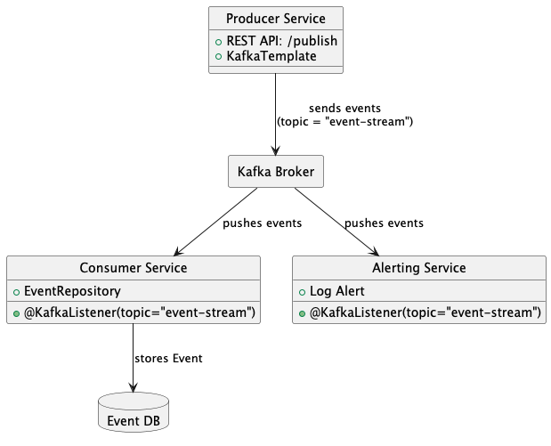

# Event Processing System

Large-scale applications often process millions of events per second (e.g., IoT systems, log processing pipelines, or financial transaction monitors). Traditional monolithic architectures struggle to meet these demands due to scalability bottlenecks and cost inefficiencies.

### Key Challenges Addressed

- **High Throughput Event Processing**: Kafka acts as the central message broker, decoupling producers and consumers for asynchronous, high-speed communication.
- **Dynamic Auto-Scaling**: Kubernetes manages containerized services and can auto-scale based on resource usage or queue depth.
- **Cost-Efficient Serverless Execution**: Modular microservices allow fine-grained resource allocation, reducing overhead and enabling possible migration to FaaS platforms (like OCI Functions).
- **Low-Latency Responses**: Services communicate over lightweight REST endpoints, and Kafka ensures real-time event delivery with minimal delay.

This system is designed with scalability, modularity, and performance in mind—ideal for event-driven architectures operating at scale.

### Key Cloud Design Considerations
- OCI API Gateway fronts your producer API securely and scalably.
- OKE (Kubernetes Engine) runs your microservices (producer, consumer).
- OCI Streaming acts as the event bus (Kafka-compatible).
- OCI Function listens for alert-worthy events and logs alerts serverlessly.
- OCI Autonomous DB stores persistent event data.
- OCI Monitoring & Logging captures observability across services.

## Local Deployment Due to OCI Free Tier Limitations
### Background
The project was originally designed to leverage Oracle Cloud Infrastructure (OCI) components for a scalable, cloud-native, event-driven architecture. The goal was to use OCI Streaming (Kafka-compatible), OCI Functions, and OKE (Oracle Kubernetes Engine) for seamless deployment and processing. However, due to resource limitations on the OCI Free Tier, the team encountered constraints that prevented successful deployment on OCI.

### OCI Service Constraints on Free Tier
| OCI Component	| Intended Role	| Free Tier Limitation |
|----------------|---------------|-----------------------|
| OCI Streaming |	Kafka-compatible event stream backbone	| Not available in free tier |
| OCI Functions	| Stateless alerting function (Java)	| Not available in free tier |
| OKE	| Container orchestration (for services)	| Free tier does not support OKE usage |
| OCI Gateway | API Gateway | Not available in free tier |

### Workaround: Local Deployment Strategy
Due to the above limitations, we pivoted to a local environment setup that simulates the intended OCI-based architecture.

#### Local Setup Details
|Component	| Technology Used |
|----------------|---------------|
|Producer Service	| Java Spring Boot + KafkaTemplate |
|Kafka Broker	| Dockerized Apache Kafka (Local) |
|Consumer Service |	Java Spring Boot + KafkaListener |
|Alerting Service	| Java Spring Boot (runs locally, mimics OCI Function)|
|Database	|PostgreSQL running in Docker|
|Monitoring & Logs|	STDOUT logs + local log files|
|OKE | Local Kubernetes| 

#### Architecture Adjustments
- OCI Streaming was replaced with a Docker-based Kafka setup.
- OCI Function was simulated using a simple Spring Boot service that listens to events and performs alerting logic.
- OCI OKE was replaced with Docker Compose to orchestrate services in a local network.
- REST endpoints were tested using tools like curl and Postman for local API interactions.

#### If Paid Services are available 
We will do the following 
- Replace Docker Kafka with OCI Streaming.
- Replace local AlertingService with OCI Function triggered via Streaming Triggers
- Deploy services to OKE, and use OCI API Gateway for routing.
- Integrate with OCI Logging and Monitoring for production observability.

#### Planned OCI deployment 
 

## Project Structure

```
event-processing/
├── producer-service/        # Publishes events to Kafka
├── consumer-service/        # Consumes and processes Kafka events
├── alerting-service/        # Sends alerts based on specific conditions
├── k8s/                     # Kubernetes deployment files
├── run-all.sh               # Script to deploy all services
```
## Architechture Diagram 
 

## Sequence Diagram 
 

## Getting Started


### Prerequisites

Make sure the following tools are installed:

- Docker
- Kubernetes 
- Maven
- Java 17+
- Curl 

### Step-by-Step Deployment Guide

#### 1. Clone the Repository

```bash
git clone <repository-url>
cd event-processing
```

#### 2. Build Docker Images

Run the following inside each microservice directory:

```bash
cd producer-service
mvn clean install
docker build -t producer-service:latest .

cd ../consumer-service
mvn clean install -Dspring.profiles.active=test
docker build -t consumer-service:latest .

cd ../alerting-service
mvn clean install
docker build -t alerting-service:latest .
```

#### 3. Docker Deployment Steps

1. Clone the repository containing the deployment scripts.
2. Navigate to the root directory containing `run-all.sh`.
3. Make the script executable:
   ```bash
   chmod +x run-all.sh
   ```
4. Run the deployment script:
   ```bash
   ./run-all.sh
   ```

The script performs the following actions:
- Cleans up any existing containers
- Creates a shared Docker network
- Deploys Zookeeper and waits for it to become available
- Deploys Kafka and waits for it to become available
- Deploys PostgreSQL
- Builds Docker images for the Producer, Consumer, and Alerting services
- Deploys all three services
- Provides a command to test the system

#### 4. Docker Troubleshooting

#### General Issues

1. **Container Startup Failure**
   - Check logs for the failing container:
     ```bash
     docker logs <container-name>
     ```
   - Ensure there is sufficient system memory and disk space.

2. **Network Connectivity Issues**
   - Verify the network was created:
     ```bash
     docker network ls | grep event-net
     ```
   - Inspect network details:
     ```bash
     docker network inspect event-net
     ```

#### Component-Specific Issues

1. **Zookeeper Issues**
   - Check Zookeeper logs:
     ```bash
     docker logs zookeeper
     ```
   - Verify port accessibility:
     ```bash
     nc -zv localhost 2181
     ```

2. **Kafka Issues**
   - Check Kafka logs:
     ```bash
     docker logs kafka
     ```
   - Verify Kafka can reach Zookeeper:
     ```bash
     docker exec kafka ping zookeeper
     ```
   - Check broker status:
     ```bash
     docker exec -it kafka kafka-topics.sh --bootstrap-server localhost:9092 --list
     ```

3. **PostgreSQL Issues**
   - Check PostgreSQL logs:
     ```bash
     docker logs postgres
     ```
   - Test database connection:
     ```bash
     docker exec -it postgres psql -U postgres -d eventdb -c "SELECT 1"
     ```

4. **Service Container Issues**
   - Check service logs:
     ```bash
     docker logs producer-service
     docker logs consumer-service
     docker logs alerting-service
     ```
   - Verify connections to Kafka:
     ```bash
     docker exec producer-service curl -v telnet://kafka:9092
     ```

5. **Image Build Failures**
   - Manually attempt to build the images:
     ```bash
     cd producer-service && docker build -t producer-service:latest .
     ```
   - Check for Docker build errors in the console output.

#### Docker Deployment 


--------------
#### 5. Deploy Using Kubernetes

From the root directory:

```bash
cd k8s
chmod +x deploy-all.sh
./deploy-all.sh
```

The script performs the following actions:
- Creates a namespace called `event-system` if it doesn't exist
- Cleans up any existing deployments
- Deploys Zookeeper and waits for it to be ready
- Deploys Kafka and PostgreSQL
- Deploys the Producer, Consumer, and Alerting services
- Applies Horizontal Pod Autoscaler (HPA) configurations for automatic scaling
- Sets up port forwarding for local testing

#### 7. Verifying Deployment

```bash
kubectl get pods
kubectl logs <pod-name>
```

You should see logs from the services interacting with Kafka.

### Kubernetes Troubleshooting

#### General Issues

1. **Namespace Issues**
   - Verify the namespace exists:
     ```bash
     kubectl get namespace event-system
     ```
   - Check namespace status:
     ```bash
     kubectl describe namespace event-system
     ```

2. **Resource Status**
   - Check the status of all pods:
     ```bash
     kubectl get pods -n event-system
     ```
   - View detailed information about a specific pod:
     ```bash
     kubectl describe pod <pod-name> -n event-system
     ```

3. **Pod Crash or Startup Failures**
   - Check pod logs:
     ```bash
     kubectl logs <pod-name> -n event-system
     ```
   - Check events for a pod:
     ```bash
     kubectl describe pod <pod-name> -n event-system | grep -A 10 Events
     ```

#### Component-Specific Issues

1. **Zookeeper Issues**
   - Check Zookeeper pod status:
     ```bash
     kubectl get pods -l app=zookeeper -n event-system
     ```
   - Check Zookeeper logs:
     ```bash
     kubectl logs -l app=zookeeper -n event-system
     ```

2. **Kafka Issues**
   - Check Kafka pod status:
     ```bash
     kubectl get pods -l app=kafka -n event-system
     ```
   - Check Kafka logs:
     ```bash
     kubectl logs -l app=kafka -n event-system
     ```
   - Verify Kafka can reach Zookeeper:
     ```bash
     kubectl exec -it $(kubectl get pod -l app=kafka -n event-system -o jsonpath='{.items[0].metadata.name}') -n event-system -- ping zookeeper-service
     ```

3. **PostgreSQL Issues**
   - Check PostgreSQL pod status:
     ```bash
     kubectl get pods -l app=postgres -n event-system
     ```
   - Check database service:
     ```bash
     kubectl get svc postgres-service -n event-system
     ```
   - Test database connection:
     ```bash
     kubectl exec -it $(kubectl get pod -l app=postgres -n event-system -o jsonpath='{.items[0].metadata.name}') -n event-system -- psql -U postgres -d eventdb -c "SELECT 1"
     ```

4. **Service Pod Issues**
   - Check service pods status:
     ```bash
     kubectl get pods -l app=producer-service -n event-system
     kubectl get pods -l app=consumer-service -n event-system
     kubectl get pods -l app=alerting-service -n event-system
     ```
   - Check service logs:
     ```bash
     kubectl logs -l app=producer-service -n event-system
     kubectl logs -l app=consumer-service -n event-system
     kubectl logs -l app=alerting-service -n event-system
     ```

5. **Service Connectivity**
   - Check service endpoints:
     ```bash
     kubectl get endpoints -n event-system
     ```

6. **HPA Issues**
   - Check HPA status:
     ```bash
     kubectl get hpa -n event-system
     ```
   - Check detailed HPA information:
     ```bash
     kubectl describe hpa producer-hpa -n event-system
     ```
   - Verify metrics are being collected:
     ```bash
     kubectl top pods -n event-system
     ```

7. **Port Forwarding Issues**
   - Verify service exists:
     ```bash
     kubectl get svc producer-service -n event-system
     ```
   - Try alternative port forwarding:
     ```bash
     kubectl port-forward deployment/producer-deployment 8080:8080 -n event-system
     ```

#### Kubernetes Deployment 


## Services Overview

- **ProducerService**: Publishes user-defined events to a Kafka topic.
- **ConsumerService**: Listens to the Kafka topic and processes the events.
- **AlertingService**: Triggers alerts based on event type/threshold.

## Testing

Use Postman or CURL to send test events to the `/publish` endpoint of the producer service (usually exposed via a NodePort or Ingress).

Example:

```bash
curl -X POST http://<node-id>:<nodeport>/publish -H "Content-Type: application/json" -d  -d '{"type":"TEMP","value":"ALERT:90"}'
```

Expected:
- `consumer-service` logs the event to DB
   ```bash 
  kubectl exec -it $(kubectl get pod -l app=postgres -n event-system -o jsonpath='{.items[0].metadata.name}') -n event-system -- psql -U postgres -d eventdb -c "SELECT * FROM EVENTS"
  ```
- `alerting-service` prints alert to console
   ```bash
  kubectl logs -l app=alerting-service  -n event-system
  ```

## Notes
- This is a simulation of Oracle Cloud Infrastructure (OCI) Functions using sidecar microservices.As OCI Functions, Steams and OCI Kubernetes Engine (OKE) is not available in free version. 
- Kafka setup uses Bitnami images.
- Recommended for dev/testing environments.
  
## Authors

Created by the IIT Jodhpur Executive M-Tech AI 2023 Team group # 30.
|Name | Roll No. | Role |
|------|--------------------|----|
|Torsha Chatterjee	|M23CSA536| Alerting Services |
|Suvodip Som	|M23CSA533| Consumer Services  |
|Swapnil Adak	|M23CSA534| Producer Service |
|Anindya Bandopadhyay	|M23CSA508| Deployment |
